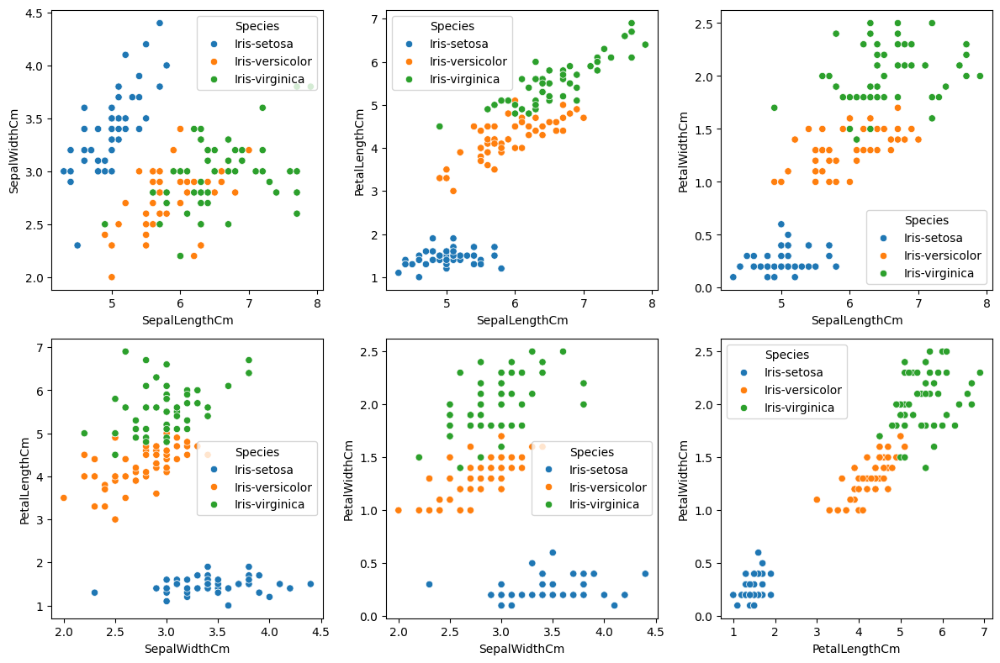
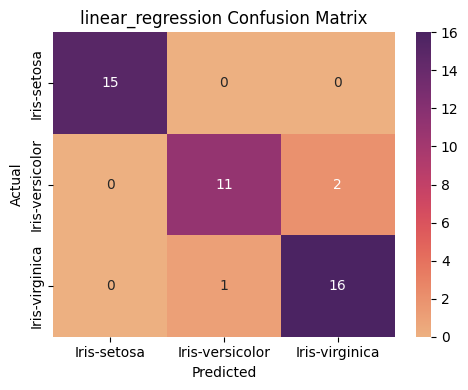
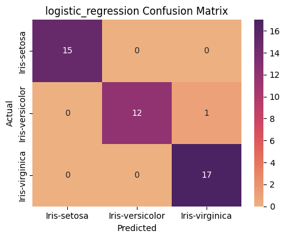
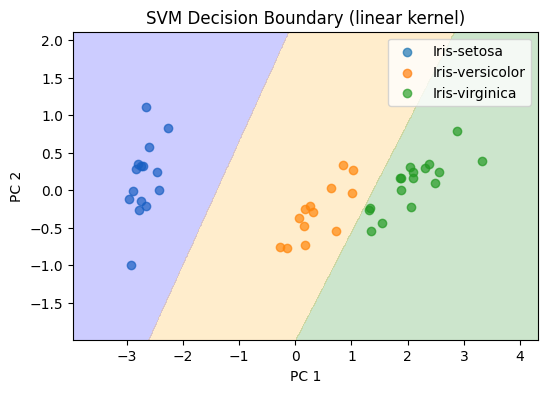
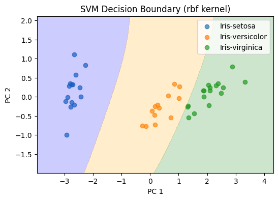
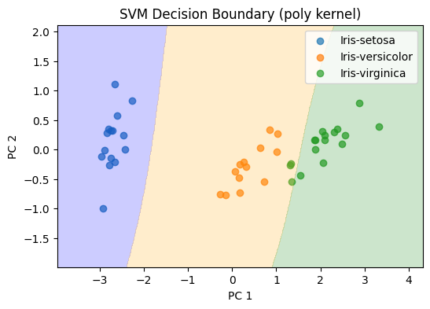

# Классификация датасета Iris

Проект демонстрирует классификацию цветков ириса с использованием трех методов:
- Linear Regression
- Logistic Regression
- Support Vector Machine 



## Содержание
1. [Требования](#требования)
2. [Структура проекта](#структура-проекта)
3. [Использование](#использование)
4. [Результаты](#результаты)

---

## Требования
- Python 3.8+
- Зависимости:
  ```bash
  pandas==1.5.3
  numpy==1.23.5
  scikit-learn==1.4.1
  scipy==1.13.0
  matplotlib-base==3.8.4
  seaborn==0.13.2
  PyYAML==6.0.1             
  joblib==1.4.2             
  ```

---

## Структура проекта
```
.
├── data                              
│   └── iris.csv
├── models                            
│   ├── linear_regression
│   │   ├── Iris-setosa_model.pkl
│   │   ├── Iris-versicolor_model.pkl
│   │   └── Iris-virginica_model.pkl
│   ├── logistic_regression
│   │   └── logistic_model.pkl
│   └── svm
│       └── svm_linear_model.pkl
├── notebook
│   └── iris_project.ipynb           
├── src
│   ├── plots                         
│   │   ├── linear_regression
│   │   ├── logistic_regression
│   │   ├── svm
│   │   └── feature_plots.py
│   ├── evaluate.py                   
│   ├── load_preprocessing.py         
│   ├── main.py                       
│   ├── training_linear.py            
│   ├── training_logistic.py          
│   └── training_svm.py               
├── config.yaml
├── README.md
└── requirements.txt             
```

---

## Использование

1. Установите зависимости:
   ```bash
   pip install -r requirements.txt
   ```

2. Запустите обучение и оценку моделей:
   ```bash
   python main.py
   ```

3. Результаты:
   - Метрики выводятся в консоль
   - Графики сохраняются в `src/plots`

---

## Результаты

### Метрики классификации
| Метод                | Accuracy | Precision | Recall |
|----------------------|----------|-----------|--------|
| Linear Regression    | 0.933    | 0.935     | 0.929  |
| Logistic Regression  | 0.978    | 0.981     | 0.974  |
| SVM (linear kernel)  | 1.000    | 1.000     | 1.000  |
| SVM (rbf kernel)     | 1.000    | 1.000     | 1.000  |
| SVM (poly kernel)    | 0.978    | 0.976     | 0.98   |

### Визуализации
**Матрицы ошибок:**
- Линейная регрессия:  
  

- Логистическая регрессия:  
  

**Разделяющие границы SVM:**
- Linear kernel:  
  

- RBF kernel:  
  

- Polynomial kernel:  
  
